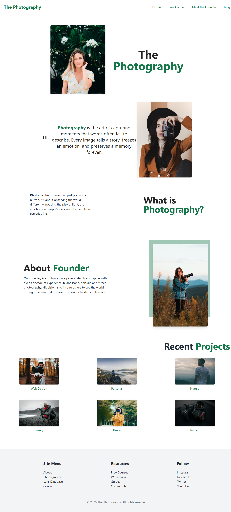

```markdown
📸 The Photography Website

A modern, responsive photography portfolio website built with **HTML** and **Tailwind CSS**.  
The site introduces photography concepts, showcases projects, and highlights the founder’s story.

```



---

```
## 🛠️ Technologies Used
- **HTML5** – Semantic and accessible structure  
- **Tailwind CSS** – Styling and responsive layout  
- **Unsplash Images** – Sample photography assets  

---

## 📂 Project Structure

project/
│── index.html        # Main website file
│── images/           # Image assets
│── README.md         # Project documentation

---

## 📜 License
This project is open-source and free to use under the **MIT License**.
```
